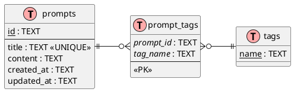

# Data Model: MCP Prompt Store

**Date**: 2026-02-19  
**Feature**: 001-mcp-prompt-store

## Entity Relationship Diagram



**Relationship**: Many-to-many via `prompt_tags` junction table. Deleting a prompt cascades to remove its tag associations.

## Entities

### 1. Prompt

Represents a stored AI prompt.

| Field | Type | Constraints | Description |
|-------|------|-------------|-------------|
| id | TEXT | PRIMARY KEY, NOT NULL | UUID v4 format |
| title | TEXT | UNIQUE, NOT NULL, max 200 chars | Human-readable prompt name |
| content | TEXT | NOT NULL | Full prompt content (no length limit) |
| created_at | TEXT | NOT NULL, ISO 8601 | Creation timestamp |
| updated_at | TEXT | NOT NULL, ISO 8601 | Last modification timestamp |

**Indexes**:
- PRIMARY KEY on `id`
- UNIQUE INDEX on `title`
- INDEX on `updated_at DESC` (for list/search ordering)

**Validation Rules**:
- `id`: Must be valid UUID v4, auto-generated on insert
- `title`: 1-200 characters, non-empty after trim
- `content`: Non-empty after trim
- `created_at`: Auto-set on insert
- `updated_at`: Auto-set on insert, auto-updated on modify

**State Transitions**: None (prompts have no lifecycle states)

### 2. Tag

Represents a category label for prompts.

| Field | Type | Constraints | Description |
|-------|------|-------------|-------------|
| name | TEXT | PRIMARY KEY, NOT NULL, max 50 chars | Lowercase tag name (alphanumeric, dash, underscore) |

**Indexes**:
- PRIMARY KEY on `name`

**Validation Rules**:
- `name`: 1-50 characters, lowercase, pattern `^[a-z0-9_-]+$`
- Case-insensitive input normalized to lowercase before storage

**State Transitions**: None

### 3. PromptTag (Junction Table)

Represents the many-to-many relationship between prompts and tags.

| Field | Type | Constraints | Description |
|-------|------|-------------|-------------|
| prompt_id | TEXT | NOT NULL, FK → prompts.id | Reference to prompt |
| tag_name | TEXT | NOT NULL, FK → tags.name | Reference to tag |

**Indexes**:
- PRIMARY KEY on `(prompt_id, tag_name)`
- INDEX on `tag_name` (for filter-by-tag queries)

**Constraints**:
- ON DELETE CASCADE on `prompt_id` (remove associations when prompt deleted)
- ON DELETE CASCADE on `tag_name` (remove associations if tag deleted)

## SQLite Schema

```sql
-- Enable WAL mode for better performance
PRAGMA journal_mode = WAL;

-- Prompts table
CREATE TABLE IF NOT EXISTS prompts (
  id TEXT PRIMARY KEY NOT NULL,
  title TEXT UNIQUE NOT NULL CHECK(length(title) > 0 AND length(title) <= 200),
  content TEXT NOT NULL CHECK(length(content) > 0),
  created_at TEXT NOT NULL DEFAULT (datetime('now')),
  updated_at TEXT NOT NULL DEFAULT (datetime('now'))
);

CREATE INDEX IF NOT EXISTS idx_prompts_updated_at ON prompts(updated_at DESC);

-- Tags table
CREATE TABLE IF NOT EXISTS tags (
  name TEXT PRIMARY KEY NOT NULL CHECK(
    length(name) > 0 AND 
    length(name) <= 50 AND 
    name GLOB '[a-z0-9_-]*'
  )
);

-- Prompt-Tag junction table
CREATE TABLE IF NOT EXISTS prompt_tags (
  prompt_id TEXT NOT NULL,
  tag_name TEXT NOT NULL,
  PRIMARY KEY (prompt_id, tag_name),
  FOREIGN KEY (prompt_id) REFERENCES prompts(id) ON DELETE CASCADE,
  FOREIGN KEY (tag_name) REFERENCES tags(name) ON DELETE CASCADE
);

CREATE INDEX IF NOT EXISTS idx_prompt_tags_tag_name ON prompt_tags(tag_name);

-- Trigger to auto-update updated_at timestamp
CREATE TRIGGER IF NOT EXISTS update_prompt_timestamp 
AFTER UPDATE ON prompts
BEGIN
  UPDATE prompts SET updated_at = datetime('now') WHERE id = NEW.id;
END;
```

## Data Operations

| Operation | Used By Tool | Spec Reference |
|-----------|--------------|----------------|
| Create Prompt with Tags | `add_prompt` | FR-001, FR-006 |
| Search Prompts | `search_prompts` | FR-003 |
| Filter by Tags | `filter_by_tags` | FR-007 |
| List Tags with Counts | `list_tags` | FR-007a |
| Delete Prompt | `delete_prompt` | FR-005 |

### Create Prompt with Tags

**Used by**: `add_prompt` tool (FR-001, FR-006)

```sql
-- 1. Insert prompt
INSERT INTO prompts (id, title, content) VALUES (?, ?, ?);

-- 2. For each tag (ensure exists, then associate)
INSERT OR IGNORE INTO tags (name) VALUES (?);
INSERT INTO prompt_tags (prompt_id, tag_name) VALUES (?, ?);
```

### Search Prompts (by keyword)

**Used by**: `search_prompts` tool (FR-003)

```sql
SELECT id, title, substr(content, 1, 200) as snippet, created_at, updated_at
FROM prompts
WHERE title LIKE ? OR content LIKE ?
ORDER BY updated_at DESC
LIMIT ? OFFSET ?;
```

### Filter by Tags (OR logic)

**Used by**: `filter_by_tags` tool (FR-007)

```sql
SELECT DISTINCT p.id, p.title, substr(p.content, 1, 200) as snippet, 
       p.created_at, p.updated_at
FROM prompts p
JOIN prompt_tags pt ON p.id = pt.prompt_id
WHERE pt.tag_name IN (?, ?, ?)
ORDER BY p.updated_at DESC
LIMIT ? OFFSET ?;
```

### List Tags with Counts

**Used by**: `list_tags` tool (FR-007a)

```sql
SELECT t.name, COUNT(pt.prompt_id) as prompt_count
FROM tags t
LEFT JOIN prompt_tags pt ON t.name = pt.tag_name
GROUP BY t.name
ORDER BY t.name ASC;
```

### Delete Prompt (cascade removes tag associations)

**Used by**: `delete_prompt` tool (FR-005)

```sql
DELETE FROM prompts WHERE id = ?;
-- prompt_tags entries removed automatically via CASCADE
```

### List Prompts (paginated)

**Used by**: `list_prompts` tool (FR-002)

```sql
SELECT id, title, substr(content, 1, 200) as snippet, created_at, updated_at
FROM prompts
ORDER BY updated_at DESC
LIMIT ? OFFSET ?;
```

### Get Prompt by ID

**Used by**: `get_prompt` tool (FR-002a)

```sql
SELECT id, title, content, created_at, updated_at
FROM prompts
WHERE id = ?;
```

### Update Prompt

**Used by**: `update_prompt` tool (FR-004)

```sql
UPDATE prompts SET title = ?, content = ? WHERE id = ?;
-- Also: replace tag associations (delete old, insert new)
DELETE FROM prompt_tags WHERE prompt_id = ?;
INSERT INTO prompt_tags (prompt_id, tag_name) VALUES (?, ?);
```
