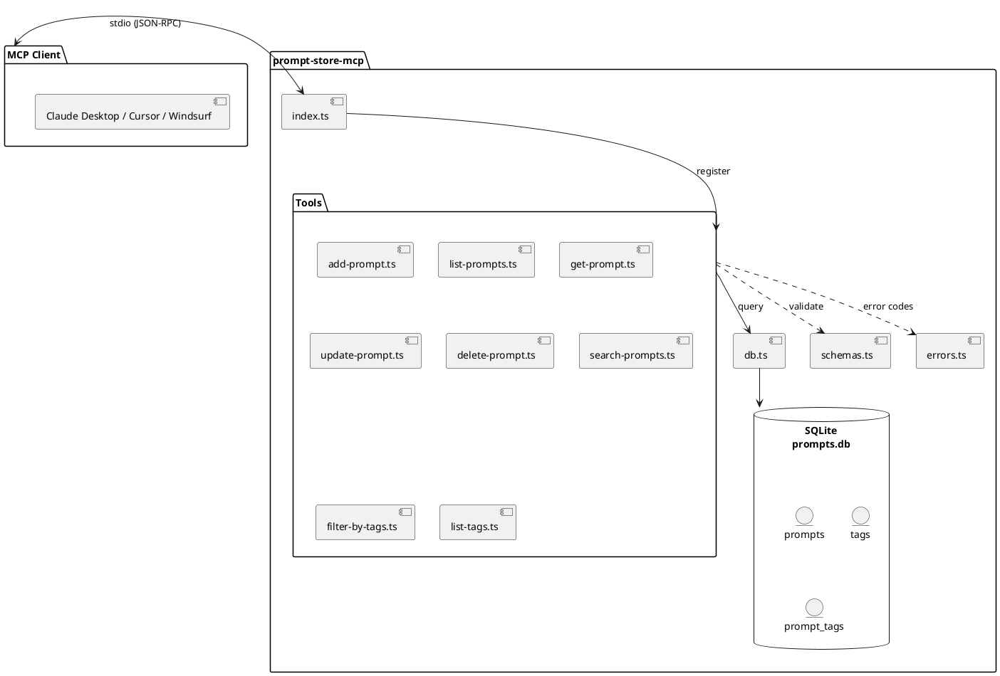
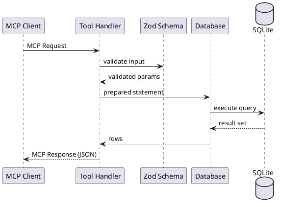

# Research: MCP Prompt Store

**Date**: 2026-02-19  
**Feature**: 001-mcp-prompt-store

## Architecture

### System Diagram



### Data Flow



### Layer Responsibilities

| Layer | Files | Responsibility |
|-------|-------|----------------|
| Entry | `index.ts` | CLI args, bootstrap server, register tools |
| Tools | `tools/*.ts` | MCP tool handlers, response formatting |
| Database | `db.ts` | SQLite connection, schema, prepared statements |
| Schemas | `schemas.ts` | Zod schemas + TypeScript types |
| Errors | `errors.ts` | Error codes and messages |

**Simplification Decisions**:
- CLI merged into `index.ts` (only 1 flag: `--reset`)
- Single `db.ts` instead of db/ directory
- Single `schemas.ts` instead of models/ + utils/
- No logger abstraction (use `console.error` directly)

## Technology Decisions

### 1. MCP SDK Integration

**Decision**: Use `@modelcontextprotocol/sdk` v1.x with stdio transport

**Rationale**: 
- Official SDK ensures compatibility with all MCP clients (Claude Desktop, Cursor, Windsurf)
- v1.x is production-ready; v2 is pre-alpha (stable release expected Q1 2026)
- stdio is the simplest transport for local servers
- No network configuration required

**Package**: 
```bash
pnpm add @modelcontextprotocol/sdk zod
```

**Alternatives Considered**:
- Custom MCP implementation: Rejected - unnecessary complexity, maintenance burden
- HTTP transport: Rejected - adds network layer, not needed for local-only use case

**Best Practices** (from official docs and community):
- Use `McpServer` class from `@modelcontextprotocol/sdk/server/mcp.js`
- Register tools with `server.registerTool()` or `server.tool()` shorthand
- Use Zod schemas directly in `inputSchema` field (SDK converts to JSON Schema)
- Log errors to stderr only (stdout reserved for MCP protocol)
- Use `StdioServerTransport` for local MCP client integration

### 2. SQLite with better-sqlite3

**Decision**: Use `better-sqlite3` with direct SQL, no ORM

**Rationale**:
- Synchronous API simplifies MCP tool handlers (no async complexity)
- Excellent performance for single-user local database
- Full SQLite feature support (FTS, triggers, etc.)
- 11.7x faster than node-sqlite3 in benchmarks
- Simpler than Drizzle ORM for this use case (3 tables, straightforward queries)

**TypeScript Import Pattern**:
```typescript
import Database, { Database as DatabaseType } from 'better-sqlite3';
const db: DatabaseType = new Database('prompts.db');
```

**Alternatives Considered**:
- Drizzle ORM: Rejected - adds abstraction layer without significant benefit for 3 tables
- Prisma: Rejected - too heavy, async-first, not ideal for synchronous MCP tools

**Best Practices**:
- Enable WAL mode: `db.pragma('journal_mode = WAL')`
- Enable foreign keys: `db.pragma('foreign_keys = ON')`
- Use prepared statements (better-sqlite3 does this automatically via `.prepare()`)
- Create indexes on `title`, `updated_at` for list/search performance
- Use transactions for multi-row operations (prompt + tag associations)
- For single-user use, checkpoint starvation is not a concern

### 3. Handlebars for Output Generation

**Decision**: Use Handlebars.js for prompt template rendering

**Rationale**:
- Lightweight templating for future prompt expansion features
- Escapes special characters safely
- Simple syntax for conditional/formatting logic

**Usage Scope**: 
- Deferred to future enhancement (prompt templates with variable interpolation)
- MVP stores raw content without transformation

**Alternatives Considered**:
- EJS: Rejected - more complex, allows arbitrary JS execution
- Mustache: Rejected - less feature-rich than Handlebars

### 4. Zod for Validation

**Decision**: Use Zod v4 (with v3.25+ backwards compatibility)

**Rationale**:
- TypeScript-first schema validation
- SDK has required peer dependency on Zod
- SDK imports from `zod/v4` internally but supports v3.25+
- Generates type definitions from schemas
- Clear error messages for validation failures
- Integrates directly with MCP tool definitions

**Best Practices**:
- Define schemas with `.describe()` for AI-readable descriptions
- Use `z.object()` shapes for input schemas
- SDK converts Zod schemas to JSON Schema automatically
- Return Zod validation errors as INVALID_INPUT error code
- Validate at tool boundaries only (internal code uses typed objects)

### 5. Vitest for Testing

**Decision**: Use Vitest for unit and integration testing

**Rationale**:
- Native TypeScript support
- Fast execution with parallel test runs
- Compatible with Jest assertions (easy migration)
- Built-in coverage reporting
- Works well with better-sqlite3 (no async mocking needed)

**Best Practices**:
- Unit tests for tool handlers with in-memory SQLite database
- Integration tests with actual database operations
- 80%+ coverage target per constitution
- Test all error paths (NOT_FOUND, DUPLICATE_TITLE, INVALID_TAG, etc.)
- Use `:memory:` databases for fast isolated tests

## Resolved Clarifications

| Question | Resolution | Source |
|----------|------------|--------|
| Prompt ID format | UUID v4 | spec.md clarification |
| Pagination default | 10 prompts, has_more flag | spec.md clarification |
| Title uniqueness | Enforced, returns DUPLICATE_TITLE error | spec.md clarification |
| Tag storage | Lowercase name as primary key | spec.md clarification |
| Orphaned tags | Retained in database | spec.md clarification |
| Database permissions | 600 (user read/write only) | spec.md clarification |
| Search matching | Case-insensitive partial match | spec.md clarification |
| Result ordering | updated_at DESC | spec.md clarification |
| Reset functionality | CLI flag only (--reset), not MCP tool | spec.md clarification |

## Integration Patterns

### MCP Server Pattern (v1.x SDK)

```typescript
import { McpServer } from "@modelcontextprotocol/sdk/server/mcp.js";
import { StdioServerTransport } from "@modelcontextprotocol/sdk/server/stdio.js";
import { z } from "zod";

const server = new McpServer({
  name: "prompt-store-mcp",
  version: "1.0.0",
});

// Register tool with Zod schema
server.tool(
  "add_prompt",
  {
    title: z.string().min(1).max(200).describe("Unique title for the prompt"),
    content: z.string().min(1).describe("Full prompt content"),
    tags: z.array(z.string()).optional().default([]).describe("Optional tags"),
  },
  async (input) => {
    // Tool handler - return structured content
    return {
      content: [{ type: "text", text: JSON.stringify(result) }],
    };
  }
);

// Connect transport
const transport = new StdioServerTransport();
await server.connect(transport);
```

### better-sqlite3 Database Pattern

```typescript
import Database from 'better-sqlite3';
import { chmodSync, mkdirSync } from 'fs';
import { homedir } from 'os';
import { join } from 'path';

const DB_DIR = join(homedir(), '.prompt-store');
const DB_PATH = join(DB_DIR, 'prompts.db');

// Ensure directory exists
mkdirSync(DB_DIR, { recursive: true });

// Open/create database
const db = new Database(DB_PATH);

// Set file permissions
chmodSync(DB_PATH, 0o600);

// Enable performance pragmas
db.pragma('journal_mode = WAL');
db.pragma('foreign_keys = ON');

// Run schema migration
db.exec(SCHEMA_SQL);
```

### Error Response Pattern

```typescript
// Consistent error structure for MCP tools
function errorResponse(code: string, message: string) {
  return {
    content: [{
      type: "text",
      text: JSON.stringify({
        error: { code, message }
      })
    }]
  };
}

// Usage in tool handler
if (!prompt) {
  return errorResponse('NOT_FOUND', 'Prompt not found');
}
```

## Performance Considerations

- **Index Strategy**: Index on `prompts.updated_at DESC` for fast list/search ordering
- **Search Implementation**: SQLite LIKE with %query% for partial matching (sufficient for 10k rows)
- **FTS Alternative**: Consider sqlite3 FTS5 extension if search becomes bottleneck (future)
- **Connection Management**: Single connection, synchronous API, no pooling needed
- **Memory Usage**: better-sqlite3 loads database pages on demand, no full-load
- **WAL Mode**: Essential for performance - readers don't block writers

## Security Considerations

- Database file permissions 600 (user-only)
- No SQL injection risk (parameterized queries via better-sqlite3)
- No authentication needed (local-only, single user)
- Input validation via Zod prevents malformed data
- Error messages sanitized (no internal details exposed)
- stderr for errors only (stdout is MCP protocol)
